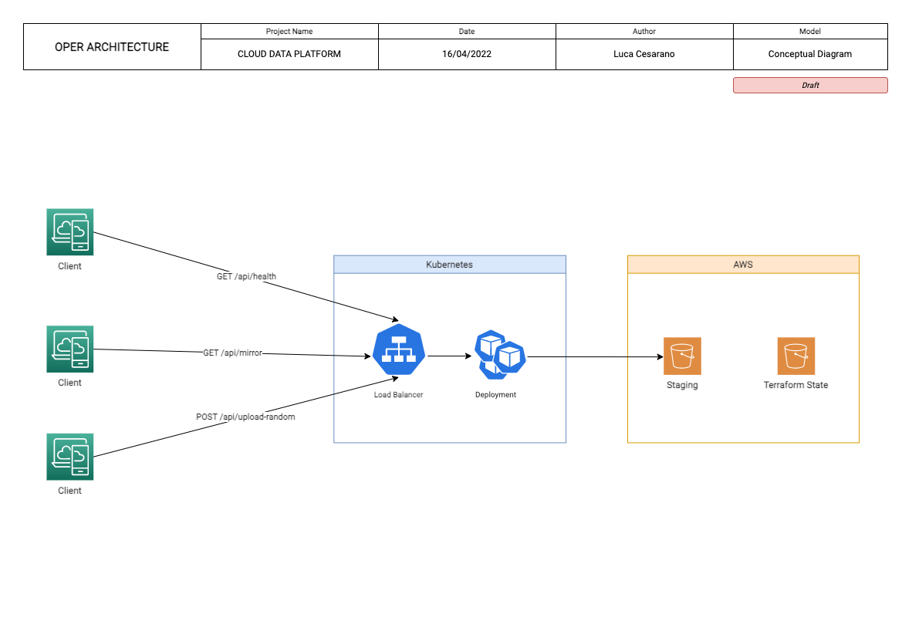
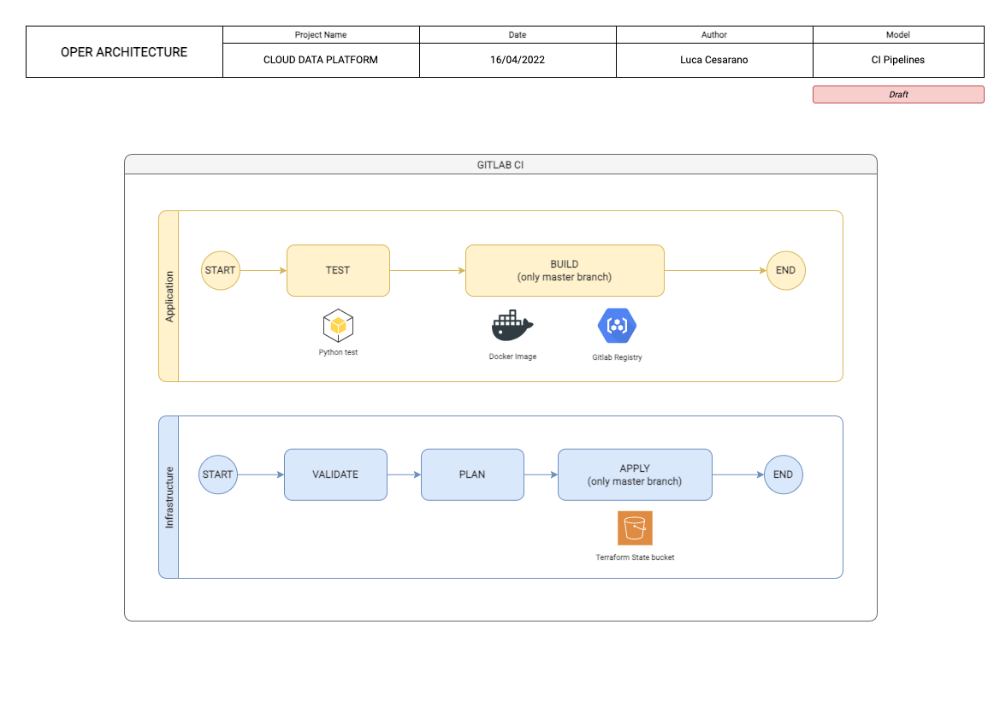

# README

Herein you will find the proposed solution to the task assigned and a detailed explanation of the solution as well as the
answer to the bonus question and suggestions of improvements.

The application code is contained in this repo.

The infrastructure code is in the following repo: https://gitlab.com/astrolu/infrastructure-oper-challenge/

# Explanation

The architecture of the proposed solution is the following:

## Technology Stack used and explanations

- **K8S**: a Minikube cluster runs locally on Mac Os. It's made of a Deployment and a Service with a LoadBalancer mapped
  on the port 80, to the webservice running on port 4545, as per requirements. It runs a gitlab agent installed with
  helm so that an automatic deployment via Terraform from the Gitlab runner on the cluster is possible.

- **CI/CD**: gitlab CI has been used to host:
    - Environment Variables for the runner
    - CI/CD pipelines and shared runner to execute them
    - Code Repository
    - Private Image Registry for the custom webserver docker image

- **Code** (under application folder): Python has been used (with Flask) to develop the webserver (tests included)
    - _src/_
        - _app.py_ contains the webserver
        - _file.py_ contains the function that creates a file
        - _s3.py_ contains the function to upload a file on S3.
        - _string_transform.py_ contains the asked operations that transform a string
    - _tests/_
        - _test.py_ contains the unit test to test the transformation of the string
    - _Dockerfile_ contains the definition for building the image
    - _requirements.txt_ containes the reqs required for the docker image
    - _.gitlab-ci.yml_ is the application pipeline

- **Testing APIs**: Postman has been used for testing the endpoint.
    - To recap, the apis are:
        - GET _/api/health_
        - GET _/api/mirror?word=abcABC123987_
        - POST _/api/upload-random_

- **IAAC** (under infrastructure folder):
    - Terraform has been used as IAAC to deploy all Kubernetes and S3 related resources.
        - Kubernetes Resources:
            - Deployment (_modules/k8s/deployment_)
            - Service (_modules/k8s/service_)
            - Secret (_modules/k8s/deployment_)
        - AWS Resources
            - Terraform State Bucket (_provider.tf_)
            - Staging Bucket for the POST API (_modules/s3_)
        - Var file (_vars/infr.tfvars.json_)
        - Pipeline (_.gitlab-ci.yml_)

- **SRE** (optional):
    - contains some utility scripts to automate some operations during the dev phase.

## Details on Pipelines

### Application Pipeline

The Application Pipeline, located under Application folder, has two phases: **test** and **build**.

**Test** will test the python code running the unit test.

If tests completed successfully, it triggers a **build** phase (_only_ on master branch) in which a docker image is
pushed to the private gitlab registry.

### Infrastructure Pipeline

The Infrastructure Pipeline is divided in three phases: **validate**, **plan**, **apply**

The **validate** phase checks if the terraform code is valid.

If so, it triggers a **plan** phase in which a tf plan is created.

A final manual **apply** phase to deploy automatically the infrastructure.

## Points of improvements

With more time given, some adjustments can be made in every part of the architecture. I would personally:

- Instead of using a local cluster, use a service like EKS to host the k8s cluster
- Develop more unit tests in the webserver
- Adjust environment variables and secrets using a secret manager like AWS Secret Manager / Parameter Store

# Bonus Question

In order to serve a general number of customers, which means creating a stable and scalable solutions, there are some
points to cover.

- High Availability (resiliency)
- Scalability

### High Availability (HA)

In order to make our Cluster resilient, AWS provides the concept of Availability Zones (AZs). Amazon Elastic
Kubernetes Service (as in every managed AWS service)
is natively HA. To be HA, the control plane of the kubernetes cluster runs and scales across many AZs.

### Scalability

Scalability is a critical aspect to take in consideration. EKS takes care of that scaling automatically the control
plane instances based on load. This means that regardless the number of users making requests to our cluster, the
cluster will automatically adapt to the load without a performance loss.

## Changes to the setup

### Terraform

Less theory and more practice, there are some changes to apply. Terraform must go to a simple refactor that will
include:

- A resource EKS
- The removal of the local minikube configuration
- Adjustments on the deployment
- The creation of a fargate runner invoked by Gitlab (see next section)

### Gitlab CI

Some changes may be applied also to the CI/CD side.

Instead of using the free shared runners that Gitlab gives to its users for free, we may create a HA solution also for
the pipeline process. This can be done registering an agent through the repository settings.

We could create a HA runner hosted on AWS ECS Fargate that will run our pipelines.